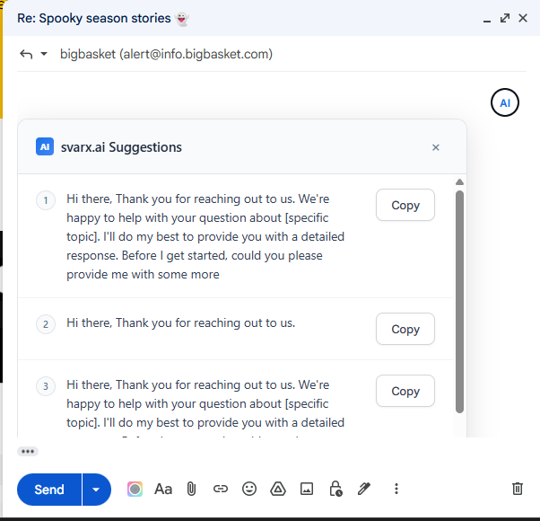
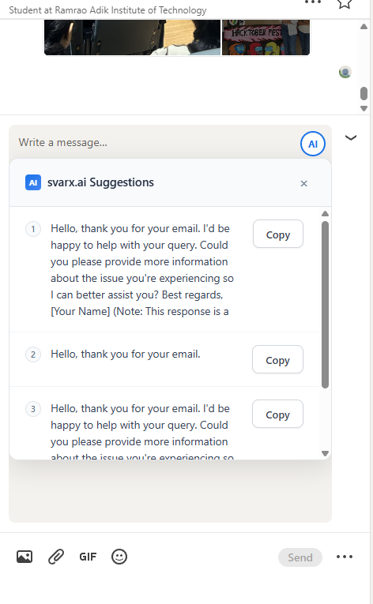
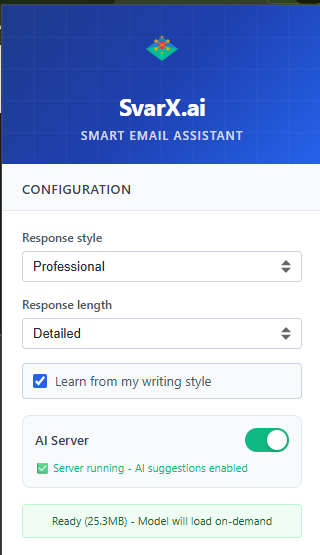
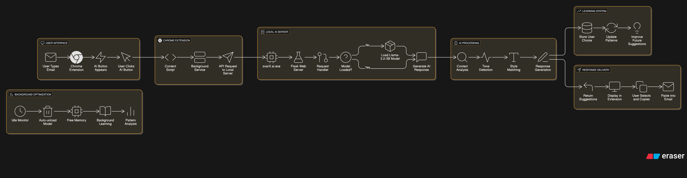
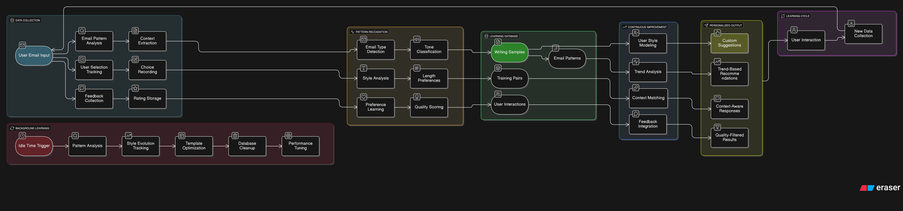

# 🚀 svarX.ai - Email Writing Made Easy

[](https://opensource.org/licenses/MIT)
[](https://www.microsoft.com/windows)
[](https://huggingface.co/meta-llama/Llama-3.2-3B)
[](https://developer.chrome.com/docs/extensions/)

> **Stop struggling with emails. Get smart suggestions that actually sound like you.**

You know that feeling when you're staring at a blank email, trying to figure out what to write? Yeah, I hate that too. That's why I built svarX.ai.

It's a simple tool that gives you email suggestions right in Gmail and LinkedIn. The cool part is it learns how you write, so the suggestions actually sound like something you'd say. And everything runs on your computer - I'm not storing your emails on some server somewhere.

## What's Cool About It?

### 🤖 **Smart Email Suggestions**
Look, I'm not going to oversell this. It's pretty straightforward - you start typing an email, click the little button that appears, and you get some decent suggestions. Sometimes they're great, sometimes they need tweaking. But they're usually better than staring at a blank screen.

The suggestions get better over time because the thing actually pays attention to what you pick and how you write.

### 🧠 **It Learns Your Style (Now with Smart Storage)**
This was the part I spent the most time on. Instead of giving you generic corporate-speak, it tries to match how you actually communicate. If you're more casual, it picks up on that. If you're formal, it goes that direction.

**New in v1.5.0:** The learning system now has intelligent 5GB storage management. When storage fills up, it automatically keeps your best learning data and removes duplicates and old negative feedback. You never lose your personalization, and it never runs out of space.

It stores all this learning stuff on your computer, not in the cloud. I know everyone says that, but you can literally see the database file sitting there in the folder.

### 🔒 **Privacy First**
Your emails don't go anywhere. The whole thing runs locally on your machine. I built it this way because I wouldn't want my emails floating around on someone else's servers either.

You can delete all the learning data whenever you want, or just uninstall the whole thing.

### ⚡ **Won't Slow You Down (Now Runs in Background)**
I tried to make it as lightweight as possible. When you're not using it, it barely uses any resources. When you need it, it loads up the language model, does its thing, then goes back to sleep.

**New in v1.5.0:** The server now runs completely in the background. No more console windows cluttering your screen, and the AI stays running even if you close the launcher. Perfect for all-day productivity.

## Getting Started

### Download and Setup

1. **Download** the latest release from the [releases page](../../releases)
2. **Extract** the files somewhere on your computer
3. **Run** `svarX.ai.exe` to start the server
4. **Install** the Chrome extension from the `extension` folder

### Setting Up the Server

When you run `svarX.ai.exe`, you'll see a simple menu with these options:

- **Start AI Server** - Launches the AI in background mode (recommended)
- **Toggle Auto-start with Windows** - Set it to start automatically when your computer boots
- **Stop Background Server** - Stop the AI if it's already running

Choose "Start AI Server" and it'll run silently in the background. You can close the launcher window and the AI keeps running.

The first time might take a few minutes because it needs to download the language model (it's about 2GB). After that, it starts up pretty quickly.

### Installing the Chrome Extension

1. Open Chrome and go to `chrome://extensions/`
2. Turn on "Developer mode" (there's a toggle in the top right)
3. Click "Load unpacked" 
4. Select the `extension` folder from where you extracted the files
5. You should see the svarX.ai extension appear in your browser

### Using It

Once everything's set up, just go to Gmail or LinkedIn and start composing a message. You should see a small "AI" button appear in the text box. Click it to get suggestions.

The suggestions will be pretty generic at first, but they get better as the system learns your writing style.

## 📸 See It in Action!

### ✍️ Gmail AI Suggestions in Action

*Smart AI suggestions right in your Gmail compose window - professional, casual, and contextual options at your fingertips! 📧*

### 💼 LinkedIn Messaging Made Easy  

*Professional networking just got smarter - AI helps you craft the perfect LinkedIn messages and posts! 💼*

### 🎛️ Chrome Extension Popup

*Clean, intuitive extension popup - server status and controls at your fingertips! 🎯*

## 🏗️ Architecture

### 🎯 **System Architecture Overview**


*Complete svarX.ai system flow - from user input to AI-powered suggestions with continuous learning*


### 📊 **Learning System Architecture**


*AI learning system with 5GB storage capacity - continuous improvement through user interactions and background analysis*


## Technical Details

### System Requirements

- **Windows 10 or 11** (64-bit)
- **4GB RAM minimum** (8GB recommended)
- **3GB free disk space** (mostly for the language model)
- **Google Chrome** (or any Chromium-based browser)
- **Python 3.8+** (the installer will help you get this if needed)

### How It Works

The core is a Llama-3.2-3B language model that runs locally on your machine. It's about 1.9GB compressed, which is pretty reasonable for what it does.

When you're not using it, the whole thing uses maybe 44MB of RAM. When you ask for suggestions, it loads up the model (uses about 3.3GB) and generates responses in 2-5 seconds, then goes back to sleep after a minute of inactivity.

The learning system stores your writing patterns in a local SQLite database with intelligent 5GB storage management. When it approaches the limit, it automatically:

- Removes duplicate samples and old negative feedback
- Keeps your most recent and highest-quality learning data  
- Preserves your personalization patterns and writing style
- Compresses old data to free up space

In practice, it grows very slowly - maybe 1MB per thousand interactions - and you never have to worry about running out of space.

### Performance

I spent a lot of time optimizing this thing because I hate software that slows down my computer. When idle, it uses basically no CPU. When learning in the background, it caps itself at 5% CPU usage. Only when you're actively getting suggestions does it use significant resources.

### Storage Management

The new intelligent storage system ensures you never run out of learning space:

**Automatic Cleanup Triggers:**
- Removes duplicate samples and responses
- Deletes old negative feedback (keeps positive longer)
- Prioritizes recent and high-quality learning data
- Compresses database to reclaim space

**Smart Data Retention:**
- Keeps 80% most recent data + 20% highest quality older data
- Preserves high-rated responses and user preferences
- Maintains your writing style patterns indefinitely
- Emergency deep cleanup if critically full

**Monitoring & Control:**
- Real-time storage status via web interface
- Manual cleanup option when needed
- Detailed statistics on what's stored
- Automatic recommendations based on usage

## 🔧 Development

### 🏃‍♂️ **Running from Source**

```bash
# Clone the repository
git clone https://github.com/yourusername/svarx-ai.git
cd svarx-ai

# Install dependencies
cd ai-engine
pip install -r requirements.txt

# Run the server
python local-server.py

# Load extension in Chrome
# 1. Go to chrome://extensions/
# 2. Enable Developer mode
# 3. Click "Load unpacked"
# 4. Select the "extension" folder
```

### 🔨 **Building EXE**

```bash
# Install PyInstaller
pip install pyinstaller

# Build the executable
pyinstaller --onefile --console --name svarX.ai svarx-one-click.py

# Output: dist/svarX.ai.exe
```

### 📁 **Project Structure**

```
svarx-ai/
├── svarX.ai.exe              # Main application (6.3MB)
├── svarx-one-click.py        # Source code for EXE
├── ai-engine/                # AI server components
│   ├── local-server.py       # Flask server with AI endpoints
│   ├── personalization.py    # Learning and storage system
│   ├── model_manager.py      # AI model management
│   ├── requirements.txt      # Python dependencies
│   ├── models/               # AI model storage
│   └── personalization.db   # Learning database (48KB)
├── extension/                # Chrome extension
│   ├── manifest.json         # Extension configuration
│   ├── content.js           # Main suggestion logic
│   ├── popup.js             # Extension popup
│   ├── background.js        # Service worker
│   ├── popup.html           # Popup interface
│   ├── styles.css           # Extension styling
│   └── icons/               # Extension icons
├── images/                   # Screenshots and demos
│   ├── system.png            # System architecture diagram
│   ├── learning.png          # Learning system architecture
│   ├── popup.png             # Chrome extension popup
│   ├── console.png           # AI server console interface
│   ├── gmail-demo.png        # Gmail AI suggestions
│   └── linkedin-demo.png     # LinkedIn AI suggestions
├── LICENSE                   # MIT License
└── README.md                # This file
```

## 🤝 Want to Help Make It Better?

We'd love your help! Whether you're a coding wizard or just someone with great ideas, there's a place for you here.

### 🐛 **Found a Bug? Tell Us!**
- Something broken? [Let us know here](../../issues)
- The more details, the better (what happened, what you expected, etc.)
- Check if someone else already reported it (save us all some time!)

### 💡 **Got a Cool Idea?**
- Dream feature in mind? [Share it with us!](../../issues)
- Tell us WHY you want it (helps us understand the real need)
- Bonus points if you think about how it might work

### 🔧 **Want to Code With Us?**
1. Fork this repo (make your own copy)
2. Create a branch with a fun name (`git checkout -b feature/mind-blowing-idea`)
3. Code away! (make it awesome)
4. Test it (please! 🙏)
5. Commit with a clear message (`git commit -m 'Add mind-blowing feature'`)
6. Push it up (`git push origin feature/mind-blowing-idea`)
7. Open a Pull Request (we'll review it with excitement!)

*Don't be shy - everyone's first contribution is welcome! 🌟*

## 📄 License

This project is licensed under the MIT License - see the [LICENSE](LICENSE) file for details.

## 🙏 Acknowledgments

- **Meta AI** for the Llama-3.2-3B model
- **Hugging Face** for model hosting and transformers library
- **Flask** team for the lightweight web framework
- **Chrome Extensions** team for the extension platform

## 📞 Need Help? We're Here!

- **Stuck?** This README probably has your answer (it's pretty thorough!)
- **Still stuck?** [Ask us anything here](../../issues) - no question is too silly
- **Want to chat?** Join our [discussions](../../discussions) - it's like a friendly coffee shop for svarX.ai users

## 🔮 What's Coming Next?

### 🎯 **Cool Stuff We're Working On**
- [ ] **Speak Your Language** - Because not everyone writes in English!
- [ ] **Outlook Love** - Yes, we see you Outlook users 👀
- [ ] **Phone App** - AI suggestions on your mobile (imagine!)
- [ ] **Team Mode** - Share the AI smarts with your whole team
- [ ] **Writing Coach** - "Hey, you're getting better at this!" insights
- [ ] **Bring Your Own AI** - Want to use a different model? Sure!

### 🚀 **How We Got Here**
- **v1.5.0** - The "smart storage & background mode" update (current!) 🎉
  - ✅ Intelligent 5GB storage management with automatic cleanup
  - ✅ True background mode - no more console windows
  - ✅ Enhanced learning system that never loses your style
  - ✅ Real-time storage monitoring and optimization
- **v1.4.0** - The "always learning" update
- **v1.3.0** - The "be nice to your computer" update
- **v1.2.0** - The "it remembers you now" update
- **v1.1.0** - The "Chrome extension magic" update
- **v1.0.0** - The "holy cow, it actually works!" release

## 🎉 Special Thanks

Huge shoutout to the amazing people and projects that made this possible:

- **Meta AI** - For making Llama models available to everyone
- **The Hugging Face Team** - For making AI accessible to mere mortals like us
- **Flask Developers** - For keeping web servers simple and sane
- **Chrome Extension Team** - For not making browser extensions a nightmare
- **You!** - For trying out our little AI assistant 💙

## A Quick Note

I built this because I was spending way too much time staring at blank email boxes, trying to figure out what to write. Especially for work emails where I wanted to sound professional but not robotic.

The suggestions aren't perfect, but they're usually a good starting point. And the fact that it learns your style over time makes it actually useful instead of just another generic tool.

If you run into issues or have ideas for improvements, feel free to open an issue. I'm pretty responsive to feedback.

Hope this saves you some time with your emails.

*- Developer*

---

<div align="center">

**Made with ❤️ for productivity enthusiasts**

[⭐ Star this repo](../../stargazers) • [🐛 Report Bug](../../issues) • [💡 Request Feature](../../issues) • [🤝 Contribute](../../pulls)

</div>